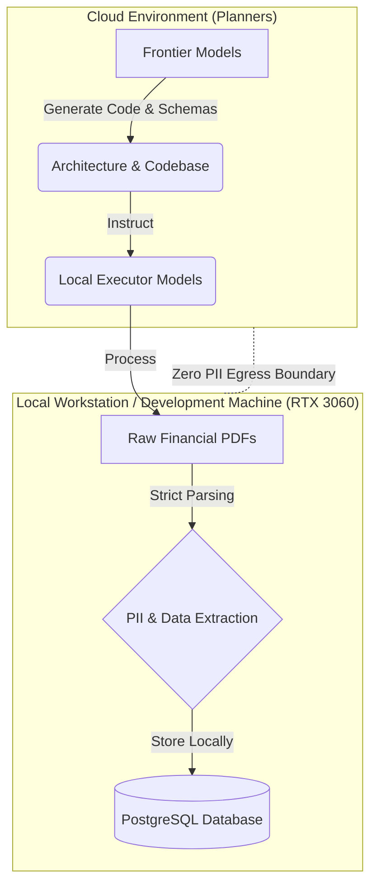

# Dual-Tier AI Financial Engine

**Dual-Tier AI Financial Engine** is a mathematically rigorous, fail-loud financial document extraction and reconciliation pipeline.

Built with an agent-driven development workflow, it enforces strict financial invariants, closed canonical schemas, and zero-PII egress. It transforms raw, ragged PDF statement data into perfectly balanced, mathematically proven ledger records.

## Architecture

This project leverages a unique **Dual-Tier AI workflow** to ensure absolute data privacy without sacrificing the cognitive capabilities of frontier models:

1. **Cloud Planners (Frontier Models):** High-capability cloud AI models act strictly as orchestration planners. They are only exposed to the architecture, data schemas, and tests. They never see raw documents or PII.
2. **Secure Executor (Local Workstation):** A local development machine/workstation equipped with an RTX 3060 acts as the secure executor. It runs local models and deterministic parsing logic to process the raw financial documents and PII locally, mathematically guaranteeing zero-PII egress to the cloud.



## Engineering Rigor

This repository is built and maintained by autonomous AI agents governed by strict, automated CI/CD gates to ensure robust, error-free operation.

- **100% Mutation Kill Rate:** The test suite utilizes `mutmut` to inject synthetic bugs into the abstract syntax tree (AST). All core financial validators mathematically require a **100% Mutation Kill Rate** (zero surviving mutants).
- **Financial Precision (`BIGINT`):** All financial values are strictly processed and stored as integer-cents (`BIGINT` in the database, `int` in Python). Floating-point arithmetic is explicitly banned to prevent rounding anomalies.
- **Test-Driven Development (TDD):** Every feature requires strict TDD and maintains >90% line and branch coverage, strictly enforced at the PR gate.

## Quick Start & Verification

**1. Install Dependencies**
```bash
uv sync
```

**2. Run the Test Suite**
```bash
uv run pytest --cov=app --cov-fail-under=90 -v
```

**3. Run Linter & Formatter**
```bash
uv run ruff check .
uv run ruff format .
```

## Troubleshooting & Agent Runbooks

### CI & Mutation Testing (`mutmut`)
* **Financial scope only:** CI mutates allowlisted modules (`app/pipeline/`, `app/adapters/`, `app/extraction/`, `app/models/`, `app/db/{repository,connection}.py`). API/dashboard/MCP/orchestrator/middleware/telemetry are **out of mutation scope** (`do_not_mutate` + diff allowlist). Those layers are gated by coverage and unit/E2E tests, not the 55% mutation floor.
* **Classic score formula:** `check_mutation_score.py` uses `killed / (killed + survived)`. `no_tests` (`🫥`) is a **separate hard fail** (`--max-no-tests 0`), not folded into the denominator.
* **Critical validator:** Whenever a mutation run executes, `app/pipeline/validator.py` is always included; zero survivors required.
* **Skip artifact:** Docs / presentation-only diffs write `mutants/mutmut-cicd-stats.json` with `skipped: true` (never a fake `killed: 1, total: 1` 100% score).
* **Single config:** mutmut 3.x is configured only in `[tool.mutmut]` in `pyproject.toml` (no `setup.cfg`). Keep `source_paths = ["app"]`; diff runs inject `only_mutate` via `scripts/run_mutation_on_diff.py`. Narrowing `source_paths` to a single file copies only that file into `mutants/` and crashes pytest (Exit Code 4).
* **Harness failures propagate:** `mutmut run` / `export-cicd-stats` non-zero exits fail the job before score math.
* **E2E exclusion:** Playwright E2E is ignored via `pytest_add_cli_args` and temporarily renamed by the diff script. The **mutation** CI job does **not** install Playwright; the coverage job still does.

### Local Coding Harness (`pi-up.sh` / `llama-up.sh`)
* **When it applies:** After any session that started local inference via `llama-up.sh` or the Tier-1 harness `pi-up.sh`.
* **RAM exhaustion (`mlock`):** `llama-server` is often started with `--load-mode mlock`, which pins model weights in RAM (~20GB) and does not swap out. **`pi-up.sh` does not stop `llama-server` on exit.**
* **End-of-session cleanup (required):**
  ```bash
  pgrep -a llama-server || true
  killall llama-server
  pgrep -a llama-server || echo "llama-server stopped"
  ```
* **Workspace vs container `/tmp`:** The harness runs in an isolated container. A file written to `/tmp/report.md` inside the container is **invisible on the host**. Always write investigation artifacts under the mounted repo, e.g. `/home/brian/Projects/assassin/tmp_report.md` (or another path under the workspace).
