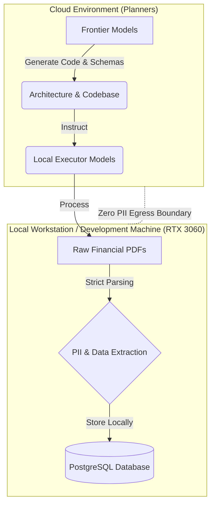

# Dual-Tier AI Financial Engine

**Dual-Tier AI Financial Engine** is a mathematically rigorous, fail-loud financial document extraction and reconciliation pipeline.

Built with an agent-driven development workflow, it enforces strict financial invariants, closed canonical schemas, and zero-PII egress. It transforms raw, ragged PDF statement data into perfectly balanced, mathematically proven ledger records.

## Architecture

This project leverages a unique **Dual-Tier AI workflow** to ensure absolute data privacy without sacrificing the cognitive capabilities of frontier models:

1. **Cloud Planners (Frontier Models):** High-capability cloud AI models act strictly as orchestration planners. They are only exposed to the architecture, data schemas, and tests. They never see raw documents or PII.
2. **Secure Executor (Local Workstation):** A local development machine/workstation equipped with an RTX 3060 acts as the secure executor. It runs local models and deterministic parsing logic to process the raw financial documents and PII locally, mathematically guaranteeing zero-PII egress to the cloud.



## Engineering Rigor

This repository is built and maintained by autonomous AI agents governed by strict, automated CI/CD gates to ensure robust, error-free operation.

- **Automated Cloud Review:** **Google Jules** acts as a self-healing cloud reviewer, constantly monitoring pull requests to enforce repository invariants, remediate failures, and guarantee flawless architectural compliance.
- **100% Mutation Kill Rate:** The test suite utilizes `mutmut` to inject synthetic bugs into the abstract syntax tree (AST). All core financial validators mathematically require a **100% Mutation Kill Rate** (zero surviving mutants).
- **Financial Precision (`BIGINT`):** All financial values are strictly processed and stored as integer-cents (`BIGINT` in the database, `int` in Python). Floating-point arithmetic is explicitly banned to prevent rounding anomalies.
- **Test-Driven Development (TDD):** Every feature requires strict TDD and maintains >90% line and branch coverage, strictly enforced at the PR gate.

## Quick Start & Verification

**1. Install Dependencies**
```bash
uv sync
```

**2. Run the Test Suite**
```bash
uv run pytest --cov=app --cov-fail-under=90 -v
```

**3. Run Linter & Formatter**
```bash
uv run ruff check .
uv run ruff format .
```
