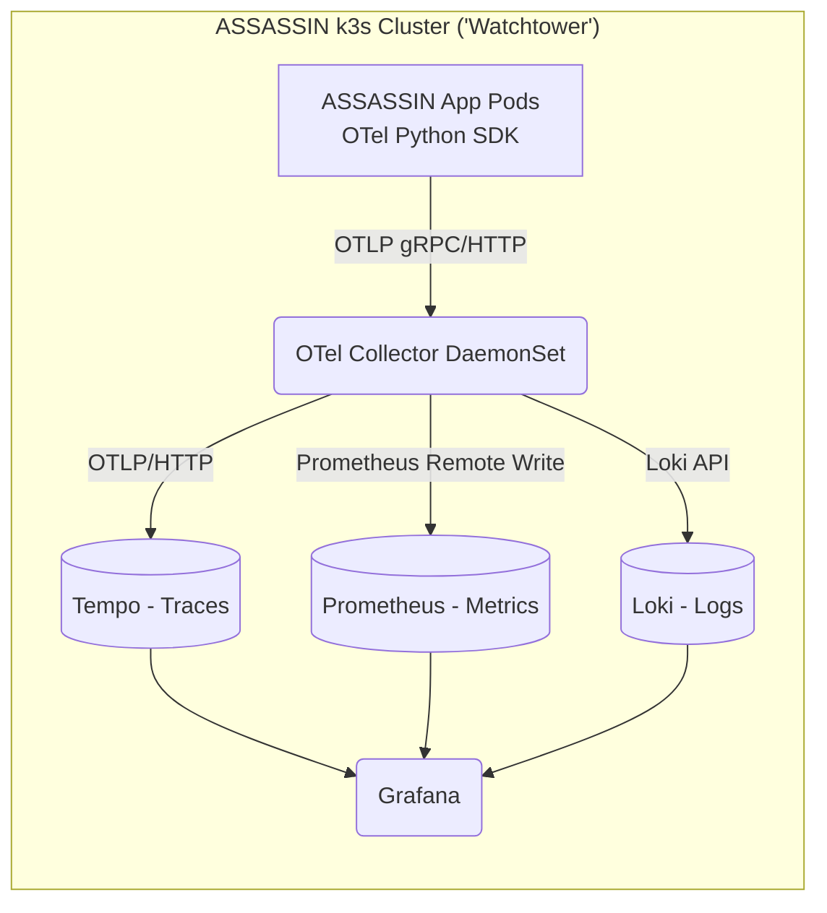

# ASSASSIN Observability & Telemetry Architecture

**Document Type:** System Architecture Specification
**Scope:** Distributed tracing, structured logging, metric collection, and PII sanitization.
**Target Environment:** Local k3s HomeLab ("Watchtower"), Traefik Ingress.

---

## 1. Telemetry Topology

Given the strict memory, disk, and network egress constraints of the "Watchtower" k3s homelab, ASSASSIN utilizes a localized, edge-terminated telemetry stack. No external SaaS APM platforms (e.g., Datadog, Honeycomb, New Relic) are permitted.

- **Instrumentation:** Services use OpenTelemetry (OTel) Python SDK for auto-instrumentation and manual spans.
- **OTel Collector:** Deployed as a DaemonSet to ensure localized node-level processing, memory limiting, and tail-sampling before forwarding to persistent storage.
- **Storage Tier:** Grafana Labs OSS stack (Tempo for traces, Prometheus for metrics, Loki for logs).

---

## 2. Tracing Context & Span Taxonomy

Traces are the primary vehicle for understanding document processing pipelines. Spans must follow a strict taxonomy to ensure correlation across distributed queue workers and API nodes.

### Mandatory Correlation Identifiers
Every trace/span must include:
- `trace_id`: Standard W3C Trace Context, generated at the API ingress edge (Traefik/FastAPI).
- `document_id`: A UUID representing the uploaded document payload (injected as a span attribute at extraction boundaries).
- `run_id`: The specific extraction attempt (UUID).

### Pipeline Stage Spans
The ingestion pipeline is broken down into distinct spans. Each stage emits a discrete span:
1. `ingress.receive`: Initial upload and cryptographic hashing.
2. `pdf.parse`: `pdfplumber` layout and text extraction.
3. `table.extract`: Heuristic or ML-based table extraction and bounding-box detection.
4. `schema.validate`: Alignment with domain constraints (`SchemaDriftError`, `MissingSectionError`).
5. `reconciliation.verify`: Financial balancing logic (`InvariantError`).

---

## 3. Logging Standards & PII Sanitization

All ASSASSIN services must output logs exclusively to `stdout` in **strict JSON format**. The OTel SDK handles appending trace context to log records.

### Mandatory Attributes
Every JSON log object must include:
- `timestamp`: ISO 8601 UTC.
- `level`: `INFO`, `WARN`, `ERROR`, `DEBUG`.
- `trace_id`: From the active OTel context.
- `span_id`: From the active OTel context.
- `logger`: Component name (e.g., `app.adapters.schwab`).

### Zero PII / Financial Data Constraints
ASSASSIN processes highly sensitive financial documents. **Logs must never leak sensitive state.**
- **No monetary amounts:** Never log raw cents, floats, or dollar strings.
  - *Violation:* `{"msg": "Parsed amount", "amount_cents": 12500}`
  - *Compliant:* `{"msg": "Parsed amount successfully", "amount_is_positive": true}`
- **No account numbers:** Never log raw or partially masked account numbers. If routing fails due to an account, log the `account_id` UUID or a deterministic hash, never the printed string.
- **No raw text:** Never log the raw `page_text` or `cell_text` scraped from the PDF, as it may contain SSNs, names, or addresses.

---

## 4. Metrics & Cardinality Bounds

Metrics provide immediate health signals. To prevent storage blowouts (Prometheus TSDB cardinality explosion) on limited homelab SSDs, strict cardinality limits apply.

### Key RED/USE Metrics
- **Parsing Duration Histogram:** `assassin_document_parse_duration_seconds`
- **Queue Lag:** `assassin_queue_depth_count` (Redis)
- **Extraction Error Counters:** `assassin_extraction_errors_total`

### Cardinality Limits
Labels on metrics must have a fixed, finite set of possible values.
- **Allowed Labels:** `account_domain` (3 values), `adapter_id` (finite), `error_type` (e.g., `SchemaDriftError`, `TokenError`).
- **Forbidden Labels:** `document_id`, `run_id`, `account_id`. Injecting UUIDs into metric labels will instantly cause a cardinality explosion and is strictly prohibited. UUIDs belong in traces and logs, not metrics.
