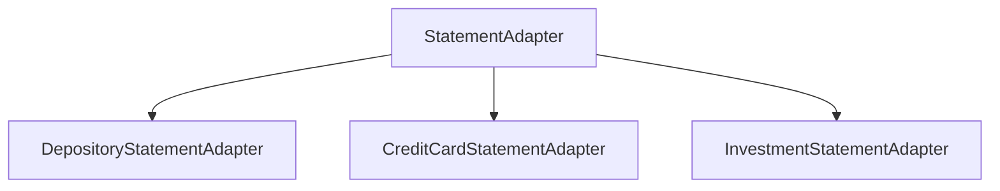

# ASSASSIN System Design Specification (multi-domain)

**Document type:** architecture and contracts only. No application logic, Alembic revisions, or service objects are produced in this slice.

**Invariants that never relax:** all money is **integer cents** (`BIGINT` / Python `int`). Raw geometry and page text are **append-only** and never mixed into canonical money columns. Unrecognized tokens, schema drift, missing mandatory markers, and ambiguous signs **fail the run**. No silent row skip, coerce, or drop.

**As-is:** the repo models a single cash brokerage envelope (`RawStatement` / `CashTransaction` / `TransactionType`) and a two-method `StatementAdapter`. That is the **Investment cash-ledger** subset only. This spec supersedes it for taxonomy, persistence (PostgreSQL), and adapter hierarchy.

---

## Domain Interface Hierarchy

### 1.1 Statement classification taxonomy

Closed enums (no free-string `account_type` on canonical rows):

- `AccountDomain`: `depository` | `revolving_credit` | `custodial_brokerage`
- `AccountType` (must be consistent with domain):
  - Depository: `checking` | `savings`
  - Revolving credit: `credit_card`
  - Custodial/brokerage: `brokerage_cash` | `brokerage_margin` (further subtypes fail until declared)
- `CurrencyCode`: start with `USD` only. Non-USD or unknown ISO codes fail. USD always has **exactly two** minor digits; other minor-unit scales are out of scope and fail.

**One PDF is not automatically one account.** A canonical **statement** is `(account, period)`. A file may yield **N** statements only if a **declared combined-statement adapter** splits them. Otherwise multiple primary balances or multiple account masks are `AmbiguousAccountsError`.

### 1.2 Primary-balance mechanics (polymorphic)

Each domain has one **primary stated balance** used for `statements.closing_balance_cents` and reconciliation. Other printed totals live on **sidecar** tables and have their own equations.

**Depository (asset balance: checking / savings)**

- Printed: opening, deposits/credits, withdrawals/debits, interest paid, fees, closing.
- Primary balance **increases** with deposits and interest paid to the customer; **decreases** with withdrawals and fees.
- Interest and fees are **line items** (or a declared summary-only bucket that must still equal the sum of matching line items). Summary-only buckets with no lines fail unless the adapter schema marks that bucket `lines_absent_explicit`.

**Revolving credit (liability balance: amount owed)**

- Printed: previous balance, payments/credits, purchases, cash advances, balance transfers, fees charged, interest charged, new balance, minimum payment due, payment due date.
- Primary balance **increases** with purchases, cash advances, balance transfers, fees, interest; **decreases** with payments and credits.
- `minimum_payment_due_cents` and `payment_due_date` are **sidecar fields**, not transactions. Missing **mandatory** markers (new balance, previous balance, payment due date when the schema requires it) fail. A product that truly has no due date must use a distinct adapter schema that declares `payment_due_date: absent`—not a null sneak-through on the default card schema.

**Custodial / brokerage (investment)**

- Two books, never collapsed into one float:
  - **Cash book (primary for `statements.closing_balance_cents` unless the adapter declares `primary_balance = portfolio`):** opening cash, income/dividends, transfers in/out, realized cash effects, closing cash.
  - **Portfolio book (sidecar):** opening portfolio value, closing portfolio value, realized gains, unrealized gains, income, transfers. Unrealized P&L is **not** a cash transaction.
- If the statement prints a complete portfolio bridge, all components are mandatory and must reconcile. If any printed component is unreadable, fail. If a component is not printed, the schema must declare it `absent`; the pipeline must not invent unrealized cents.

### 1.3 Signed cents convention (global)

Canonical `transactions.amount_cents` is a **signed BIGINT**, **delta to the domain primary balance**, never a float, never zero.

- Depository deposit / interest received: `+N`
- Depository withdrawal / fee: `-N`
- Card purchase / advance / BT / fee / interest charged: `+N` (owed **up**)
- Card payment / credit / fee reversal: `-N` (owed **down**)
- Brokerage cash credit: `+N`; cash debit: `-N`

`transaction_category` is a **closed** enum (union of domain kinds). Category **must not** contradict sign (purchase with negative amount is `TokenError`). Sign is taken only from **declared columns** (e.g. Withdrawals vs Deposits) or a **single** documented print convention (`-` / `()`). If column and glyph disagree, fail. Ambiguous sign (one amount column, no glyph, no debit/credit column) fails—no heuristic from description text.

**Balances** (`opening`, `closing`, card `new_balance`, brokerage cash) are **signed BIGINT** (depository and card typically non-negative; margin and some cards may be negative—store the signed value, do not abs()).

**Do not** reuse “unsigned magnitude + CREDIT/DEBIT” as the persistence shape; that model inverted card vs bank semantics. Direction is implied by the sign of the primary-balance delta plus `transaction_category`.

### 1.4 Adapter class hierarchy




`**StatementAdapter` (all domains)**

- Identity: `adapter_id`, `adapter_version`, `institution_id`, `account_domain`, `account_type` (or a closed set if one adapter handles checking and savings with **distinct** declared schemas).
- `matches(path) -> bool` — page-1 / header detection only; no mapping.
- `extract(path) -> RawExtraction` — **every** page: full text, words/cells with bounding boxes (`x0_mp`, `y0_mp`, `x1_mp`, `y1_mp`; see **raw_tokens geometry note**). Cell values remain **text**. No cents in raw.
- `declared_schemas() -> Sequence[TableSchema]` — exact header tuples and mandatory **section markers** (anchor strings). Extra or missing headers fail (`SchemaDriftError`). Missing mandatory anchors fail (`MissingSectionError`).
- Registry: **exclusive** match (0 or 2+ adapters → fail). Combined multi-account files use a dedicated adapter whose `matches` is mutually exclusive with single-account adapters.

`**DepositoryStatementAdapter**`

- `parse_header` / detect account mask, type (checking vs savings), period.
- `parse_summary` → opening, closing, stated totals for deposits, withdrawals, interest, fees.
- `parse_transactions` → closed cash table; every non-blank row maps or fails.
- `verify_summary_equation` — see § Balance Reconciliation.
- `verify_line_sum_vs_summary` — sum of categorized lines equals printed buckets.

`**CreditCardStatementAdapter**`

- Same lifecycle: header, summary (previous, new, min due, due date, bucket totals), transactions, `verify_card_equation`, `verify_line_sum_vs_summary`.
- Cash advances, BT, fees, interest are **first-class categories**, not optional skips.

`**InvestmentStatementAdapter**`

- Header / account mask / period.
- `parse_cash_summary` + `parse_portfolio_summary` (portfolio may be `absent` only if declared).
- `parse_cash_transactions` + `parse_holdings` (holdings closed schema; share qty as `quantity_nanos BIGINT`, not float; `market_value_cents BIGINT`).
- `verify_cash_equation`; `verify_portfolio_bridge` iff schema says the bridge is present.

Orchestrator order: **append raw** → exclusive `matches` → `extract` → closed schema validate → domain `parse_`* → domain `verify_`* → insert canonical. Canonical insert is forbidden if any verify fails. Failed runs still leave raw rows (`RunStatus.failed`).

---

## Canonical PostgreSQL Schema Definitions

Design DDL (not an applied migration). All money `BIGINT`. No `DOUBLE PRECISION` / `REAL` / `MONEY` / `NUMERIC` for currency. Bboxes are integers, not floats. Raw payloads are **never updated**.

```sql
-- Append-only raw (geometry + text). No monetary interpretation.
CREATE TABLE raw_payloads (
  raw_payload_id     UUID PRIMARY KEY,
  content_sha256     CHAR(64) NOT NULL,
  byte_length        BIGINT NOT NULL CHECK (byte_length > 0),
  original_basename  TEXT NOT NULL,
  ingested_at        TIMESTAMPTZ NOT NULL,
  UNIQUE (content_sha256)  -- blob identity; re-parse creates a new run, not a new blob
);

CREATE TABLE extraction_runs (
  run_id             UUID PRIMARY KEY,
  raw_payload_id     UUID NOT NULL REFERENCES raw_payloads (raw_payload_id),
  adapter_id         TEXT NOT NULL,
  adapter_version    TEXT NOT NULL,
  started_at         TIMESTAMPTZ NOT NULL,
  status             TEXT NOT NULL CHECK (status IN (
                       'raw_stored', 'extracted', 'validated',
                       'canonical_persisted', 'failed')),
  error_code         TEXT,
  error_message      TEXT,
  CHECK (
    (status = 'failed') = (error_code IS NOT NULL)
  )
);

CREATE TABLE raw_pages (
  raw_page_id        UUID PRIMARY KEY,
  run_id             UUID NOT NULL REFERENCES extraction_runs (run_id),
  page_number        INT NOT NULL CHECK (page_number >= 1),
  page_text          TEXT NOT NULL,
  UNIQUE (run_id, page_number)
);

-- One row per pdfplumber word or table cell. Token text stays TEXT (no cents).
CREATE TABLE raw_tokens (
  raw_token_id       UUID PRIMARY KEY,
  raw_page_id        UUID NOT NULL REFERENCES raw_pages (raw_page_id),
  token_kind         TEXT NOT NULL CHECK (token_kind IN ('word', 'cell')),
  token_text         TEXT NOT NULL,
  x0_mp              BIGINT NOT NULL,
  y0_mp              BIGINT NOT NULL,
  x1_mp              BIGINT NOT NULL,
  y1_mp              BIGINT NOT NULL,
  table_index        INT,
  row_index          INT,
  col_index          INT
);
```

**raw_tokens geometry note.** `x0_mp`, `y0_mp`, `x1_mp`, and `y1_mp` are the token's axis-aligned bounding box on the PDF page. They exist so later stages can recover reading order, which table a cell belonged to, and spatial overlap **without re-opening the PDF**. They are layout, not money: never interpret them as cents or balances.

- **Unit:** integer millipoints (1/1000 of a PDF point). No floating-point storage.
- **Space:** pdfplumber page coordinates; origin at the **top-left** of the page; `x` increases to the right; `y` increases downward.
- **Mapping:** `x0_mp` / `x1_mp` are left / right edges (`round(x0 * 1000)`, `round(x1 * 1000)`). `y0_mp` / `y1_mp` are upper / lower edges (`round(top * 1000)`, `round(bottom * 1000)`).
- **Invariants:** `x1_mp > x0_mp >= 0` and `y1_mp > y0_mp >= 0`. These four columns live only on append-only `raw_tokens`, never on canonical transaction or balance rows.

```sql
CREATE TABLE accounts (
  account_id         UUID PRIMARY KEY,
  institution        TEXT NOT NULL,
  account_mask       TEXT NOT NULL,
  account_domain     TEXT NOT NULL CHECK (account_domain IN (
                       'depository', 'revolving_credit', 'custodial_brokerage')),
  account_type       TEXT NOT NULL,
  currency           CHAR(3) NOT NULL CHECK (currency = 'USD'),
  UNIQUE (institution, account_mask, account_type),
  CHECK (
    (account_domain = 'depository' AND account_type IN ('checking', 'savings'))
    OR (account_domain = 'revolving_credit' AND account_type = 'credit_card')
    OR (account_domain = 'custodial_brokerage'
        AND account_type IN ('brokerage_cash', 'brokerage_margin'))
  )
);

CREATE TABLE statements (
  statement_id           UUID PRIMARY KEY,
  account_id             UUID NOT NULL REFERENCES accounts (account_id),
  run_id                 UUID NOT NULL REFERENCES extraction_runs (run_id),
  raw_payload_id         UUID NOT NULL REFERENCES raw_payloads (raw_payload_id),
  statement_start_date   DATE NOT NULL,
  statement_end_date     DATE NOT NULL,
  opening_balance_cents  BIGINT NOT NULL,
  closing_balance_cents  BIGINT NOT NULL,
  net_change_cents       BIGINT NOT NULL,
  CHECK (statement_start_date <= statement_end_date),
  CHECK (net_change_cents = closing_balance_cents - opening_balance_cents),
  UNIQUE (account_id, statement_start_date, statement_end_date, run_id)
);

CREATE TABLE statement_depository_summaries (
  statement_id              UUID PRIMARY KEY REFERENCES statements (statement_id),
  deposits_cents            BIGINT NOT NULL CHECK (deposits_cents >= 0),
  withdrawals_cents         BIGINT NOT NULL CHECK (withdrawals_cents >= 0),
  interest_paid_cents       BIGINT NOT NULL CHECK (interest_paid_cents >= 0),
  fees_cents                BIGINT NOT NULL CHECK (fees_cents >= 0)
);

CREATE TABLE statement_credit_summaries (
  statement_id                  UUID PRIMARY KEY REFERENCES statements (statement_id),
  previous_balance_cents        BIGINT NOT NULL,
  payments_credits_cents        BIGINT NOT NULL CHECK (payments_credits_cents >= 0),
  purchases_cents               BIGINT NOT NULL CHECK (purchases_cents >= 0),
  cash_advances_cents           BIGINT NOT NULL CHECK (cash_advances_cents >= 0),
  balance_transfers_cents       BIGINT NOT NULL CHECK (balance_transfers_cents >= 0),
  fees_charged_cents            BIGINT NOT NULL CHECK (fees_charged_cents >= 0),
  interest_charged_cents        BIGINT NOT NULL CHECK (interest_charged_cents >= 0),
  new_balance_cents             BIGINT NOT NULL,
  minimum_payment_due_cents     BIGINT NOT NULL CHECK (minimum_payment_due_cents >= 0),
  payment_due_date              DATE NOT NULL
);

CREATE TABLE statement_brokerage_summaries (
  statement_id                      UUID PRIMARY KEY REFERENCES statements (statement_id),
  opening_cash_cents                BIGINT NOT NULL,
  closing_cash_cents                BIGINT NOT NULL,
  opening_portfolio_cents           BIGINT,
  closing_portfolio_cents           BIGINT,
  realized_gains_cents              BIGINT,
  unrealized_gains_cents            BIGINT,
  income_dividends_cents            BIGINT,
  transfers_in_cents                BIGINT,
  transfers_out_cents               BIGINT,
  CHECK (
    (opening_portfolio_cents IS NULL) = (closing_portfolio_cents IS NULL)
  )
);

CREATE TABLE transactions (
  transaction_id         UUID PRIMARY KEY,
  statement_id           UUID NOT NULL REFERENCES statements (statement_id),
  post_date              DATE NOT NULL,
  transaction_date       DATE,
  amount_cents           BIGINT NOT NULL CHECK (amount_cents <> 0),
  description            TEXT NOT NULL CHECK (char_length(description) >= 1),
  transaction_category   TEXT NOT NULL,
  balance_after_cents    BIGINT
);
```

**Category closed sets (enforced in app + CHECK or domain enum types):**

- Depository: `deposit` | `withdrawal` | `interest_paid` | `fee` | `fee_reversal` | `other_credit` | `other_debit`
- Card: `purchase` | `payment` | `credit` | `cash_advance` | `balance_transfer` | `fee` | `interest_charged` | `fee_reversal`
- Brokerage cash: `dividend` | `interest` | `transfer_in` | `transfer_out` | `fee` | `trade_cash` | `other_credit` | `other_debit`

**Normalization notes**

- Exactly **one** sidecar row per statement, matching `accounts.account_domain`. Inserting the wrong sidecar is a contract error.
- `statements.opening_balance_cents` **equals** depository opening, card `previous_balance_cents`, or brokerage `opening_cash_cents` (cash-primary).
- `statements.closing_balance_cents` **equals** depository closing, card `new_balance_cents`, or brokerage `closing_cash_cents`.
- `raw_payload_id` on `statements` is denormalized for join convenience; it must match `extraction_runs.raw_payload_id` for `run_id`.
- Re-ingest of the same bytes: **same** `raw_payloads` row, **new** `extraction_runs` (and new canonical statement keyed by `run_id`). Never `UPDATE` raw_pages/raw_tokens.
- Holdings (brokerage) remain a later table (`holdings`: `quantity_nanos`, `market_value_cents`); not required to start depository/card.

---

## Balance Reconciliation Validation Rules

All arithmetic is integer. First failure aborts canonical persist (`InvariantError`).

**Universal (all domains)**

1. `net_change_cents == closing_balance_cents - opening_balance_cents`
2. `closing_balance_cents == opening_balance_cents + SUM(transactions.amount_cents)`
  This is the single primary-balance identity. It is the stored form of “opening + credits − debits = closing” once credits are positive deltas and debits are negative deltas.
3. If any `balance_after_cents` is non-null, **all** lines on that statement must have it, in statement order, and `balance_after` must equal opening + running sum of `amount_cents` through that row. Partial running balances fail.
4. Dates: `post_date` in `[statement_start_date, statement_end_date]` unless the adapter schema explicitly allows out-of-cycle posts (then a dedicated field `cycle_exception` is required—default is fail).
5. `SUM(amount_cents) == net_change_cents`

**Depository buckets**

- `deposits_cents + interest_paid_cents` == sum of positive amounts in deposit/interest (and `other_credit`) categories as declared.
- `withdrawals_cents + fees_cents` == absolute value of sums of withdrawal/fee/`other_debit` (fee_reversal is negative fee: must reduce `fees_cents` bucket or have a stated reversal line that matches).
- Equation in unsigned buckets:  
`opening + deposits + interest_paid - withdrawals - fees == closing`  
must agree with the signed-sum identity (1 cent mismatch fails).

**Credit card**

- `new_balance_cents == previous_balance_cents + purchases + cash_advances + balance_transfers + fees_charged + interest_charged - payments_credits`
- `statements.opening_balance_cents == previous_balance_cents`
- `statements.closing_balance_cents == new_balance_cents`
- Line sums must equal each printed bucket. Mid-cycle interest is a **transaction** with category `interest_charged` and positive `amount_cents`; it must be included in `interest_charged_cents`.
- Fee reversal: category `fee_reversal`, **negative** `amount_cents`; printed fees bucket must match net (fees − reversals) or the statement must print reversals separately—mismatch fails.
- `payment_due_date` required on default card schema; `minimum_payment_due_cents >= 0`. Due date before period start is allowed only if printed (do not “correct”).

**Brokerage**

- Cash: `opening_cash + SUM(cash amount_cents) == closing_cash` (same as universal, cash-primary).
- Portfolio bridge **when present**:  
`opening_portfolio + transfers_in - transfers_out + income_dividends + realized_gains + unrealized_gains == closing_portfolio`  
with each term **signed cents** as printed (losses negative). Missing printed term → fail, not assume zero.
- Do not apply the cash equation to portfolio value.

**Multi-account aggregate statements**

- If page 1 (or any page) contains **two or more** distinct account masks or two **primary** balance sections (e.g. checking total and savings total) and the adapter is single-account: `**AmbiguousAccountsError`**. Do not take the first account, do not merge, do not drop the second.
- Combined adapters must emit **one `statements` row per account**, same `raw_payload_id` / `run_id`, each with its own sidecar and transactions. If a shared “combined total” exists, it is raw-only unless a declared `combined_total_cents` validates as the sum of per-account closings.

---

## Implementation Sequence and Testing Strategy

### Sequence (dependency order; each slice testable)

1. **Contracts freeze** — enums, signed delta rule, exception types, rename in-memory `RawStatement` → canonical vs `RawExtraction`. Python 3.14 / uv / pytest / pdfplumber. Track `tests/fixtures` in git.
2. **Fail-loud extract core** — raw pages + integer bboxes + closed headers; no domain mapping yet. Tests: extra column, missing marker, ragged row.
3. **Depository adapter + validators** — checking fixture first, then savings (same domain, different `account_type` / possibly different markers).
4. **Credit-card adapter + validators** — including due date and bucket identity.
5. **PostgreSQL persist** — append-only raw + accounts/statements/sidecars/transactions as specified; tests that `UPDATE` of raw is not part of the API and reparse adds `run_id`.
6. **Investment adapter** — extend existing Schwab cash work to this hierarchy (cash equation + optional portfolio bridge + holdings later).
7. **Exclusive registry** across domains; overlapping `matches` fails.
8. **Combined multi-account adapter or explicit fail fixtures** (do not silently support aggregates).
9. Local ingest API last; no PII egress.

Do **not** persist canonical before fail-loud extract. Do **not** start FastAPI before one depository and one card path round-trip.

### Synthetic fixture contracts (must exist as JSON tokens + expected canonical cents)


| Fixture                                   | Domain      | Must assert                                                       |
| ----------------------------------------- | ----------- | ----------------------------------------------------------------- |
| `checking_happy`                          | checking    | opening + signed lines = closing; deposits/fees buckets           |
| `savings_interest`                        | savings     | interest_paid line and summary bucket match                       |
| `card_happy`                              | credit_card | previous + buckets = new; min due; due date                       |
| `card_missing_due_date`                   | credit_card | **fail** `MissingSectionError` on default schema                  |
| `card_midcycle_interest`                  | credit_card | interest line included in sum and `interest_charged_cents`        |
| `fee_reversal_bank` / `fee_reversal_card` | both        | negative delta; fees bucket nets correctly or fail                |
| `ambiguous_sign`                          | any         | single amount column, no glyph, no debit/credit header → **fail** |
| `checking_plus_savings_page1`             | aggregate   | single-account adapter **fail** `AmbiguousAccountsError`          |
| `schema_extra_column`                     | any         | **fail** `SchemaDriftError`                                       |
| `brokerage_cash_happy`                    | investment  | existing cash identity in signed form                             |


No real customer PDFs. Cell strings in fixtures; expected `*_cents` as JSON integers. Optional synthetic PDF later; raw-layer tests assert `x0_mp`/`y0_mp`/`x1_mp`/`y1_mp` as defined in the raw_tokens geometry note.

### Failure-mode assertions (every adapter)

- Unrecognized header token, missing mandatory section marker, unparseable money (≠ 2 decimal digits), zero amount, category/sign contradiction, 1-cent recon break, overlapping adapter match, multi-account on a single-account adapter.

---

## Mapping from current code

- [app/models/canonical.py](app/models/canonical.py) `TransactionType` + unsigned `amount_cents` become signed primary-balance deltas + `transaction_category`.
- [app/pipeline/validator.py](app/pipeline/validator.py) cash identity remains, restated as `opening + SUM(signed amounts) = closing`, then domain bucket checks.
- [app/adapters/base.py](app/adapters/base.py) splits into the three abstract subclasses above; Schwab becomes `InvestmentStatementAdapter`.
- Uncommitted Schwab `continue` on bad rows remains **out of contract** and must not be generalized to bank/card parsers.

